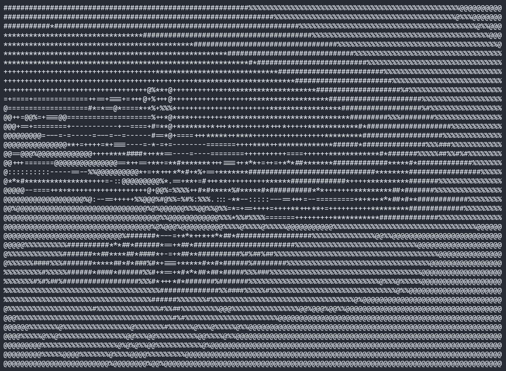
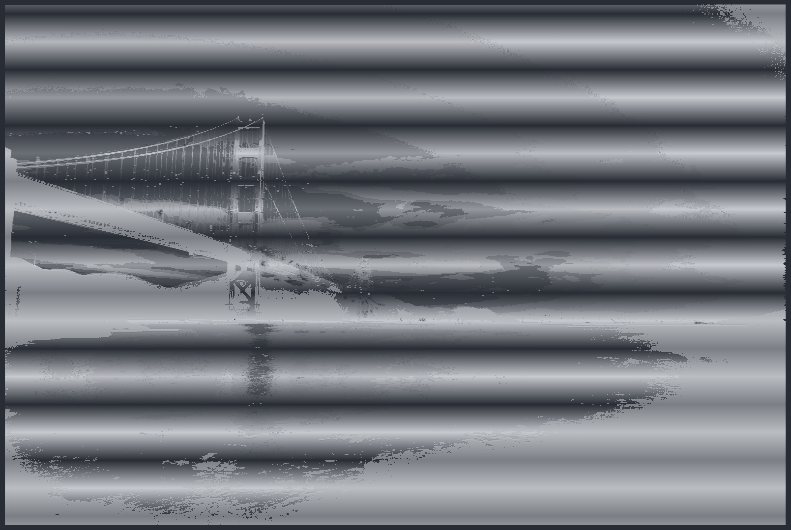
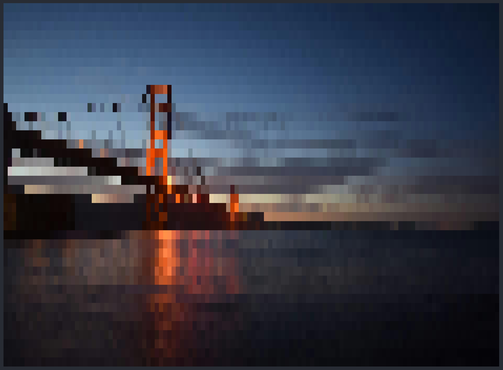

# *imgToAscii*

*imgToAscii* is a CLI tool that helps you view images in your terminal window by converting them into ASCII art representations without relying on any external applications.

## Features

- Converts images into text-based ASCII art
- Supports grayscale and true RGB color output (ANSI escape codes)
- Automatically maintains correct aspect ratio
- Supports common image formats: PNG, JPG, JPEG, BMP, TGA, GIF (first frame)
- Fast and minimal — uses stb_image header-only library
- Works on Windows / Linux / macOS terminals

## Modes

- Grayscale Mode: Converts images to grayscale ASCII art.
- Color Mode: Converts images to colored ASCII art using ANSI escape codes.

## Installation

### 1. Clone the repository

```bash
git clone https://github.com/Jais-Shreyas/imgToAscii.git
cd imgToAscii
```

### 2. Compile the program using a C++ compiler

```bash
g++ imgToAscii.cpp -o imgToAscii
```

Or with warnings enabled:

```bash
g++ imgToAscii.cpp -o imgToAscii -O2 -Wall
```
### Alternative: Download the prebuilt executable

1. Go to **Releases**.
2. Download the suitable executable for your OS:
   - **Windows**: `imgToAscii-windows.exe`
   - **Linux**: `imgToAscii-linux`
3. Rename the executable to `imgToAscii` and place it in a directory of your choice.
4. Make sure it has execute permissions (Linux/macOS only).

You can also use the following commands to **download the executable directly and add it to your system `PATH`**, so it can be run from anywhere.

---

### Windows (PowerShell)

```powershell
# Download
wget "https://github.com/Jais-Shreyas/imgToAscii/releases/download/v1.0.0/imgToAscii-windows.exe" -O imgToAscii.exe

# Create a bin directory (if it doesn't exist)
$bin = "$env:USERPROFILE\bin"
New-Item -ItemType Directory -Force -Path $bin | Out-Null

# Move executable
Move-Item imgToAscii.exe "$bin\imgToAscii.exe"

# Add to PATH (persistent, user-level)
$current = [Environment]::GetEnvironmentVariable("PATH", "User")
if ($current -notlike "*$bin*") {
    [Environment]::SetEnvironmentVariable(
        "PATH",
        "$current;$bin",
        "User"
    )
}

Write-Host "Installed imgToAscii. Restart the terminal to use it from anywhere."
```

🔁 **Restart the terminal** after this.

Run from anywhere:

```powershell
imgToAscii --help
```

---

### Linux (Bash)

```bash
# Download
wget "https://github.com/Jais-Shreyas/imgToAscii/releases/download/v1.0.0/imgToAscii-linux" -O imgToAscii

# Make executable
chmod +x imgToAscii

# Move to a directory in PATH
mkdir -p ~/.local/bin
mv imgToAscii ~/.local/bin/

# Ensure ~/.local/bin is in PATH
echo 'export PATH="$HOME/.local/bin:$PATH"' >> ~/.bashrc
source ~/.bashrc
```

Run from anywhere:

```bash
imgToAscii --help
```

---

### Notes

- On Linux/macOS, `~/.local/bin` is the recommended user-level install location.
- On Windows, `C:\Users\<you>\bin` is a safe, user-local alternative to system directories.
- If you built the executable locally and did not add it to `PATH`, run it using `./imgToAscii` instead.

## Usage

```bash
imgToAscii -i <image_path> [-h <new_height>] [-m <mode>] [-o <output_path>]
```

## Arguments

| Argument | Parameter         | Description                                                                      |
| -------- | ----------------- | -------------------------------------------------------------------------------- |
| `-i`   | `<image_path>`  | Path to the input image (relative or absolute).**Required.**               |
| `-h`   | `<new_height>`  | Output height (number of text rows). Width auto-scales to maintain aspect ratio. |
| `-m`   | `<mode>`        | Output mode:`ascii` for grayscale ASCII, `rgb` for colored output.           |
| `-o`   | `<output_path>` | Write output to a file instead of terminal.                                      |

## Notes

- If `-h` is not provided, the current height of terminal (number of lines) is used.
- If `-m` is not provided, the default mode is `rgb`.
- If `-o` is omitted, output is printed to the terminal.

## Examples

### Source Image


---

## Grayscale ASCII

**Command**

```bash
imgToAscii -m ascii -i public/sample.jpg
```

### Normal View



### Zoomed-Out Terminal View



---

## Colored ASCII

**Command**

```bash
imgToAscii -m rgb -i public/sample.jpg
```

### Normal View



### Zoomed-Out Terminal View


---

### Need help?

Run:

```bash
imgToAscii --help
```

to see detailed usage instructions.
