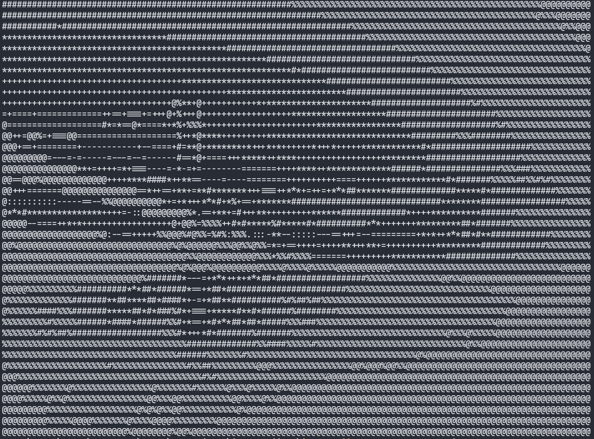
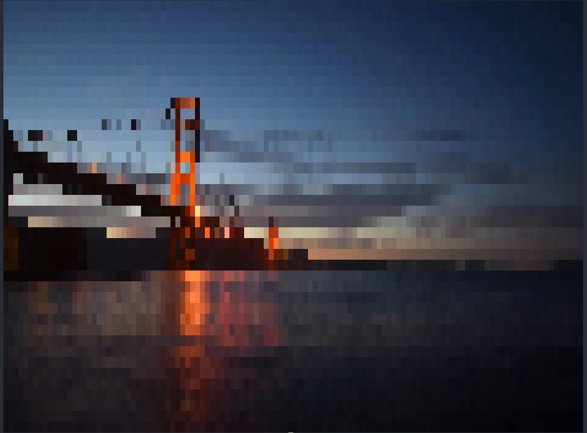
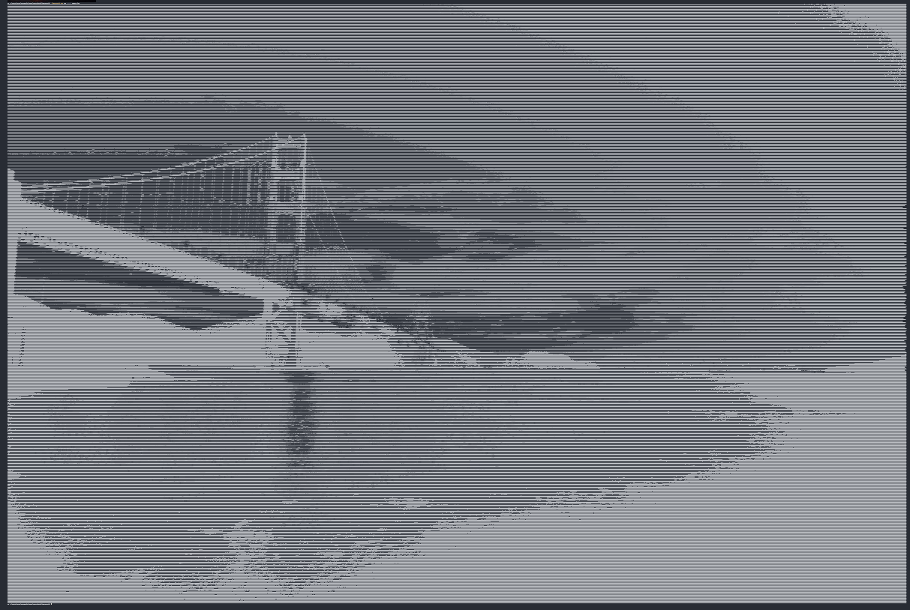
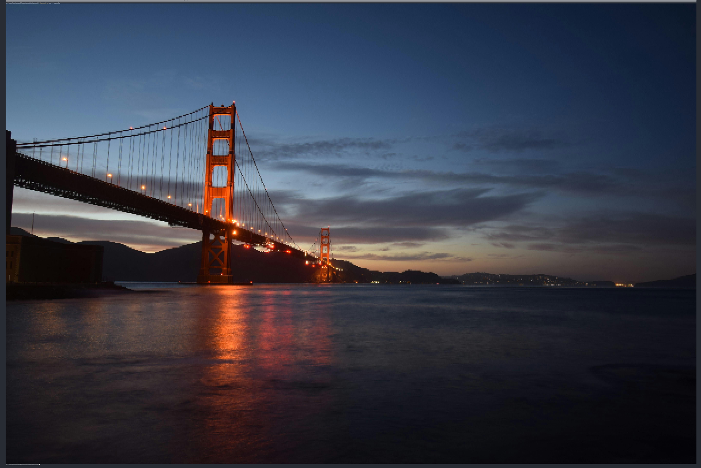

# *imgToAscii*
*imgToAscii* is a CLI tool that helps you view images in your terminal window by converting them into ASCII art representations without relying on any external applications.

## Features
- Converts images into text-based ASCII art
- Supports grayscale and true RGB color output (ANSI escape codes)
- Automatically maintains correct aspect ratio
- Supports common image formats: PNG, JPG, JPEG, BMP, TGA, GIF (first frame)
- Fast and minimal — uses stb_image header-only library
- Works on Windows / Linux / macOS terminals

## Modes

- Grayscale Mode: Converts images to grayscale ASCII art.
- Color Mode: Converts images to colored ASCII art using ANSI escape codes.

## Installation

### 1. Clone the repository
```bash
git clone https://github.com/Jais-Shreyas/imgToAscii.git
cd imgToAscii
```

### 2. Compile the program using a C++ compiler
```bash
g++ imgToAscii.cpp -o imgToAscii
```

Or with warnings enabled:
```bash
g++ imgToAscii.cpp -o imgToAscii -O2 -Wall
```

### Alternative: Download the prebuilt executable

1. Go to **Releases**
2. Download the suitable executable for your OS:
    - **Windows**: `imgToAscii-windows.exe`
    - **Linux**: `imgToAscii-linux`
3. Place the executable in your desired directory, and rename it to `imgToAscii` and give it execute permissions if necessary.

You can also use the following commands to download directly:
- **Windows**:
  ```bash
  wget "https://github.com/Jais-Shreyas/imgToAscii/releases/download/v1.0.0/imgToAscii-windows.exe" -O imgToAscii.exe
  ```
- **Linux**:
  ```bash
  wget "https://github.com/Jais-Shreyas/imgToAscii/releases/download/v1.0.0/imgToAscii-linux" -O imgToAscii
  chmod +x imgToAscii
  ```

## Usage

```bash
./imgToAscii <height> <mode> <image_path>
```

### Arguments

| Argument        | Description                                                                 |
|-----------------|-----------------------------------------------------------------------------|
| `<height>`      | Output height (number of text rows). Width auto-scales to keep aspect ratio. |
| `<mode>`        | `-ascii` for grayscale ASCII, `-rgb` for colored output.                     |
| `<image_path>`  | Path to the input image (relative or absolute).                              |

## Examples
### Source Image


### Grayscale ASCII
```bash
./imgToAscii 40 -ascii public/sample.jpg
```

<hr>

### Colored ASCII (RGB)
```bash
./imgToAscii 40 -rgb public/sample.jpg
```

<hr>

### High-resolution ASCII (for zoomed-out terminals)
```bash
./imgToAscii 400 -ascii public/sample.jpg
```

<hr>

### High-resolution RGB
```bash
./imgToAscii 400 -rgb public/sample.jpg
```


<hr>